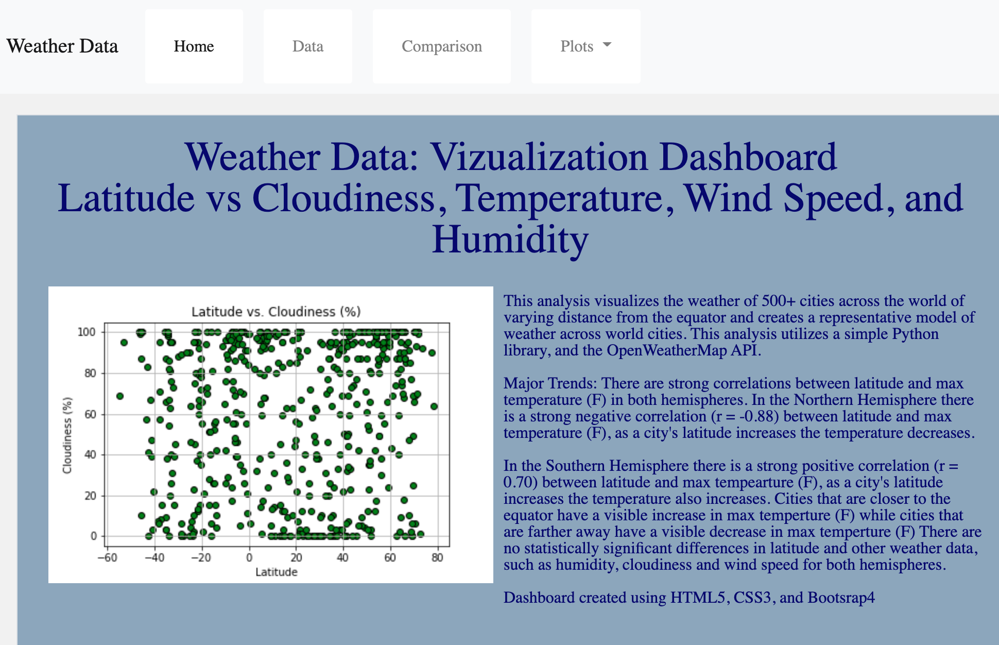
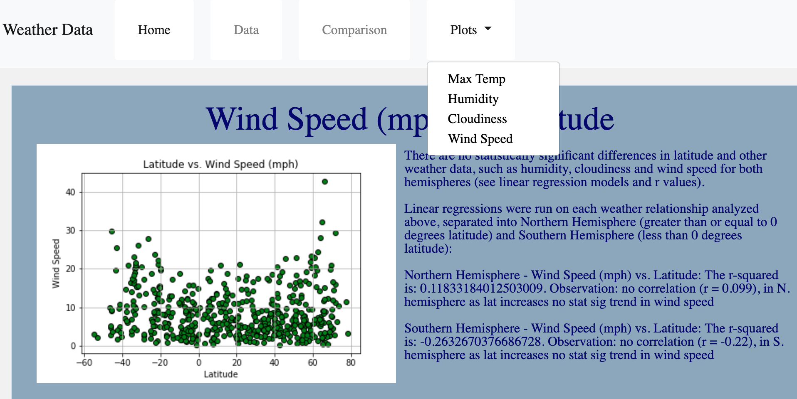
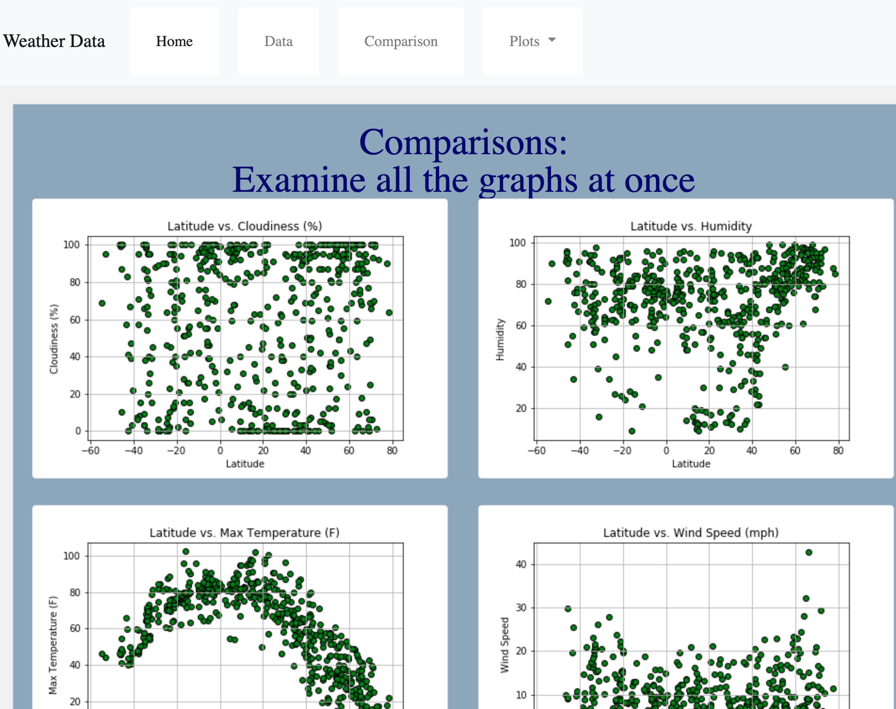
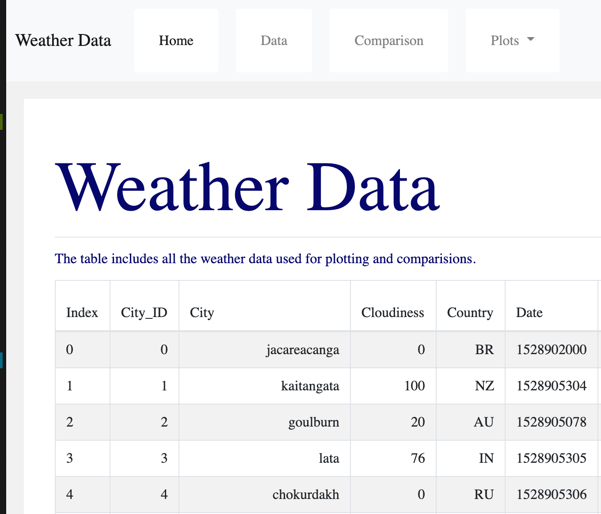
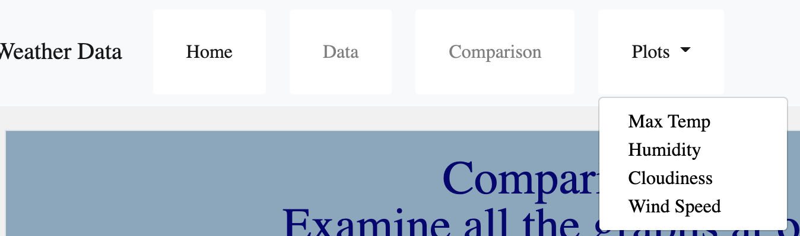

# Web-Design-Challenge - Web Visualization Dashboard (Latitude)

## [A visualization dashboard website was created using visualizations from previous weather data and HTML5, CSS3, and Bootstrap4](https://lrios215.github.io/Web-Design-Challenge/WebVisualizations/landing.html)

## The website consists of 7 pages total, including:

* A Landing Page containing:
  * An explanation of the project.
  * Links to each visualizations page. There should be a sidebar containing preview images of each plot, and clicking an image should take the user to that visualization.
  

* Four Visualizations Pages (plots), each with:
  * A descriptive title and heading tag.
  * The plot/visualization itself for the selected comparison.
  * A paragraph describing the plot and its significance.
  

* A Comparisons" page that:
  * Contains all of the visualizations on the same page so we can easily visually compare them.
  * Uses a Bootstrap grid for the visualizations.
    * The grid is two visualizations across on screens medium and larger, and 1 across on extra-small and small screens.
  

* A "Data" page that:
  * Displays a responsive table containing the data used in the visualizations.
    * The table is a bootstrap table component.
    * The data must came from exporting a .csv file as HTML. Pandas `to_html` was used to generate a HTML table from a pandas dataframe. 
  

The website also has a navigation menu at the top of every page that:

  * Has the name of the site on the left of the nav which allows users to return to the landing page from any page.
  * Contains a dropdown menu on the right of the navbar named "Plots" that provides a link to each individual visualization page.
  * Provides two more text links on the right: "Comparisons," which links to the comparisons page, and "Data," which links to the data page.
  * Is responsive (using media queries). 
  

